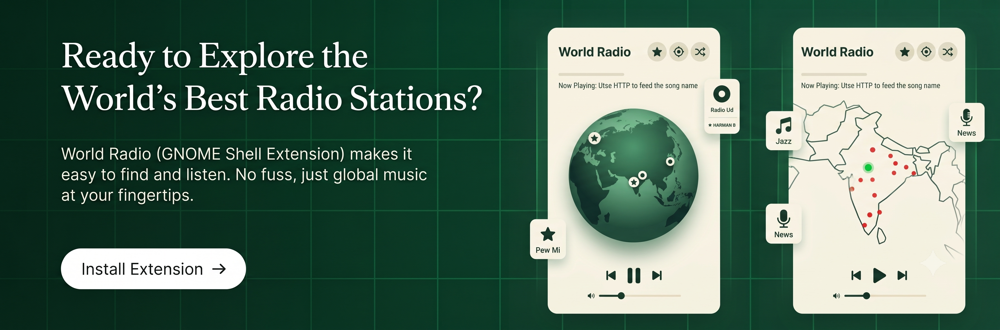

<p align="center">
  
</p>
# World Radio (GNOME Shell Extension)
[](https://extensions.gnome.org/)
[](LICENSE)
[]()


> **An interactive 3D orthographic globe for your GNOME panel that lets you explore and stream live radio stations from every corner of Earth.**

Inspired by Radio Garden and retro-modern audio hardware, **World Radio** brings the planet's airwaves to your desktop. Click the globe icon on your panel to summon a sleek 9:16 vertical card featuring a fully interactive 3D globe, live online radio markers, station follow presets, and seamless native audio playback.

---

## ✨ Features

- **🌍 Interactive 3D Orthographic Globe**:
  - Smooth 3D sphere projection rendered at 60 FPS using hardware-accelerated Cairo.
  - Complete world landmasses and graticule grid (parallels and meridians).
  - Click and drag to spin Earth in all directions (longitude and latitude tilt).
  - Click anywhere on the ocean or land to smoothly re-center the camera.

- **🔍 Deep Zoom Range (10x)**:
  - Scroll wheel / touchpad zoom from an orbital view (`55px` radius) down into fine regional details (`550px` radius).
  - As you zoom in, station markers expand and spread out for pinpoint selection.

- **📻 300+ Live Radio Stations Worldwide**:
  - Curated collection of 80+ top stations covering every continent, verified with high-bitrate AAC/MP3 streams.
  - Automatic background discovery of up to 250 additional online stations via the community-driven Radio Browser API.
  - Accurate latitude and longitude placement for every station on Earth.

- **🎯 Pinpoint Station Selection & Tooltips**:
  - Hovering over any red dot displays a floating tooltip with the station name, city, country, and genre.
  - Precise hit-testing ensures that clicking a station immediately begins streaming that exact broadcast.
  - Active playing stations display an animated pulsing green/gold halo ring.

- **★ Follow Up to 4 Stations (Presets Bar)**:
  - Favorite any station using the star (`★`) button in the header.
  - Follow up to 4 stations in the quick-access presets bar (`★ Slot 1` – `★ Slot 4`).
  - Clicking any followed preset instantly pans the 3D globe and plays that station.
  - Presets persist across reboots in `~/.config/world-radio-favorites.json`.

- **📍 Intelligent Geolocation Auto-Adjustment**:
  - Auto-detects client-side approximate location to center the globe on your home region on launch.
  - Dedicated **Locate Me** button (`🎯`) to return home anytime.
  - **Explore / Shuffle** button (`🎲`) to discover random stations worldwide.

- **📐 Flexible Panel Support (Top & Bottom Panels)**:
  - Native support for standard GNOME top bar as well as bottom panels (e.g. `dash-to-panel`).
  - Automatically detects panel position and opens upward (`St.Side.BOTTOM`) or downward (`St.Side.TOP`), anchored directly to the globe icon.

- **🎵 Native Low-Latency Audio Streaming**:
  - Powered directly by GStreamer (`Gst.playbin`) for glitch-free playback, native volume control, and ICY metadata decoding.

---

## 🎮 Controls & Mouse Shortcuts

| Action | Control | Description |
| :--- | :--- | :--- |
| **Spin Globe** | `Left Click + Drag` | Rotates the globe across latitude and longitude |
| **Zoom In / Out** | `Mouse Wheel` / `Two-Finger Scroll` | Zooms between 55px (overview) and 550px (deep regional zoom) |
| **Select & Play** | `Left Click on Station Dot` | Immediately targets and streams that station |
| **Re-center Camera** | `Left Click on Globe Surface` | Inverts orthographic projection and centers on clicked point |
| **Inspect Station** | `Hover Cursor over Dot` | Displays floating tooltip with country, city, genre, and station name |
| **Follow / Unfollow** | `Click ★ Button` / `Click Preset Slot` | Adds or removes station from your 4 quick-access preset slots |
| **Play / Pause** | `Click Center Circle Button` | Toggles streaming on the currently selected station |
| **Previous / Next** | `Click ⏮ / ⏭ Buttons` | Skips to adjacent stations in catalog |
| **Locate Me** | `Click 🎯 Button` | Re-centers camera on your geographic region |
| **Random Station** | `Click 🎲 Button` | Spins to an exciting random station somewhere on Earth |

---

## 🔍 Transparency: Libraries, APIs & Data Sources

World Radio is committed to complete transparency, privacy, and adherence to open-source standards. Below are the libraries, data sources, and remote services utilized:

### 1. Audio Playback Engine
* **[GStreamer](https://gstreamer.freedesktop.org/) (`gi://Gst`)**:
  * The extension utilizes the GNOME desktop's built-in GStreamer framework via `Gst.ElementFactory.make('playbin', ...)`.
  * Audio streams are decoded directly through the system's native multimedia pipeline without external helper binaries or Electron wrappers.

### 2. Graphics & Vector Projection
* **[Cairo Graphics](https://www.cairographics.org/) (`cairo`) & [Clutter / St](https://gitlab.gnome.org/GNOME/mutter)**:
  * The 3D globe is mathematically rendered using Cairo on an `St.DrawingArea`.
  * Computes standard orthographic projection transforms:
    $$\begin{aligned} x &= R \cos(\phi) \sin(\lambda - \lambda_0) \\ y &= -R \left(\cos(\phi_0) \sin(\phi) - \sin(\phi_0) \cos(\phi) \cos(\lambda - \lambda_0)\right) \\ z &= \sin(\phi_0) \sin(\phi) + \cos(\phi_0) \cos(\phi) \cos(\lambda - \lambda_0) \end{aligned}$$
  * Only front-facing hemisphere vertices ($z > 0$) are drawn, clipped cleanly to the spherical disc with atmospheric radial gradients.

### 3. Geographical Landmass Geometry
* **[Natural Earth Vector Data](https://www.naturalearthdata.com/) (`ne_110m_land`)**:
  * Continents and island contours are derived from public-domain Natural Earth 1:110m physical land vector datasets.
  * Vector rings are pre-densified and simplified using the Ramer–Douglas–Peucker algorithm (`landData.js`) for lightweight 60 FPS vector drawing with zero runtime file I/O.

### 4. Community Radio Directory
* **[Radio Browser API](https://www.radio-browser.info/) (`api.radio-browser.info`)**:
  * Used as an open, community-maintained directory to discover active live radio streams and station geocoordinates.
  * Requests are made asynchronously via `Soup.Session` (Libsoup 3.0) with standard user-agent identification. No user tracking or private data is transmitted.

### 5. Geolocation Detection (Optional Client-Side Lookup)
* **[FreeIPAPI](https://freeipapi.com/) & [IPWhoIs](https://ipwho.is/)**:
  * Used solely on initial launch to retrieve the user's approximate coordinates (city/country level) so the globe can rotate to their region.
  * The lookup is fully optional, client-side only, and does not require account keys. If the service is unreachable or network is unavailable, the extension smoothly falls back to default coordinates.

---

## 📦 Installation

### Method 1: From GNOME Extensions Website (Recommended)
*Search for **World Radio** on [extensions.gnome.org](https://extensions.gnome.org/) and toggle the install switch.*

---

### Method 2: Manual Installation from Source

1. Clone or download this repository:
   ```bash
   git clone https://github.com/chanduu/world-radio.git ~/.local/share/gnome-shell/extensions/world-radio@chanduu
   ```

2. Reload GNOME Shell:
   * **Wayland**: Log out and log back in.
   * **X11**: Press `Alt + F2`, type `r`, and press `Enter`.

3. Enable the extension:
   ```bash
   gnome-extensions enable world-radio@chanduu
   ```

---

## 🛠️ Building & Packaging for EGO Submission

To create an official `.zip` bundle for submission to the **GNOME Shell Extensions Library (EGO)**:

```bash
# Navigate to the extension source directory
cd /path/to/world-radio

# Package the extension with all required assets
gnome-extensions pack \
  --extra-source=globeView.js \
  --extra-source=landData.js \
  --extra-source=radioIndicator.js \
  --extra-source=radioPlayer.js \
  --extra-source=radioService.js \
  --extra-source=icons \
  --force

# The bundle will be output as:
# world-radio@chanduu.shell-extension.zip
```

You can test installing the generated bundle locally using:
```bash
gnome-extensions install --force world-radio@chanduu.shell-extension.zip
```

---

## 📋 GNOME Extensions Review Guidelines Compliance

This extension is built in strict adherence to [GNOME Extensions Review Guidelines](https://gjs.guide/extensions/review-guidelines/review-checklist.html):
- ✅ **Modern ESM Architecture**: Written completely in ES Modules (`export default class ... extends Extension`), compliant with GNOME 45+.
- ✅ **No Eval or Code Injection**: Does not use `eval()`, `Function()`, or external executable scripts.
- ✅ **Proper Lifecycle Management**: All timers (`GLib.source_remove`), GStreamer pipelines, and signal handlers are completely destroyed on `disable()`.
- ✅ **No Memory Leaks**: Cairo contexts are explicitly disposed via `cr.$dispose()`.
- ✅ **Responsive & Non-Blocking**: All network operations use asynchronous Libsoup 3 (`send_and_read_async`).
- ✅ **Respects GNOME HIG**: Clean layout, standard symbolic icons, and adaptive styling compatible with light and dark themes.

---

## 📂 Project Structure

```
world-radio/
├── extension.js            # Extension entry point & lifecycle manager
├── metadata.json           # Extension UUID, name, and GNOME Shell version targets
├── radioIndicator.js       # Panel indicator, 9:16 card UI, favorites & placement logic
├── globeView.js            # Cairo 3D orthographic globe, zoom, rotation & station rendering
├── landData.js             # Densified world landmass coordinates from Natural Earth
├── radioPlayer.js          # GStreamer playbin audio streaming pipeline
├── radioService.js         # Curated stations catalog, Radio Browser API & geolocation
├── stylesheet.css          # Styling for 9:16 card, media controls, and presets
├── icons/
│   └── world-globe-symbolic.svg # Custom panel globe icon
├── LICENSE                 # GNU General Public License v3.0
└── README.md               # Project documentation & reference
```

---

## 🐞 Troubleshooting & Logs

To check runtime logs or debug output in real time, run:

```bash
journalctl -b 0 -f /usr/bin/gnome-shell | grep -i "WorldRadio"
```

To reload or re-enable the extension after editing:
```bash
gnome-extensions disable world-radio@chanduu
gnome-extensions enable world-radio@chanduu
```

---

## 📜 License

Distributed under the **GNU General Public License v3.0 (GPL-3.0)**.  
See [LICENSE](LICENSE) for details.

---

### ❤️ Acknowledgements
- [Radio Browser](https://www.radio-browser.info/) for community radio stream directories.
- [Natural Earth](https://www.naturalearthdata.com/) for public domain cartographic vector data.
- The GNOME and GJS development community.
